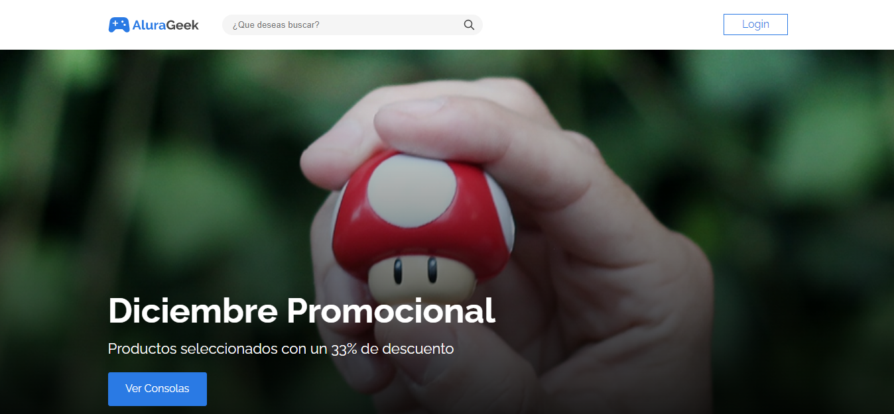

# Challenge ONE | Front End -  E-Commerce

<a href="https://www.linkedin.com/in/joelmiguelvalente" target="_blank"></a>



### ¡Bienvenido al proyecto BETA del E-Commerce !

Si descargas este repo y quieres probarlo de manera local debes tener:
 - [NodeJS](https://nodejs.org/en/)

Luego ejecutar
```
npm install -g json-server
```

Luego, una vez instalado el "**JSON-SERVER**" tienes que ejecutar _(obviamente, dentro del proyecto)_
```
json-server --watch db.json
```